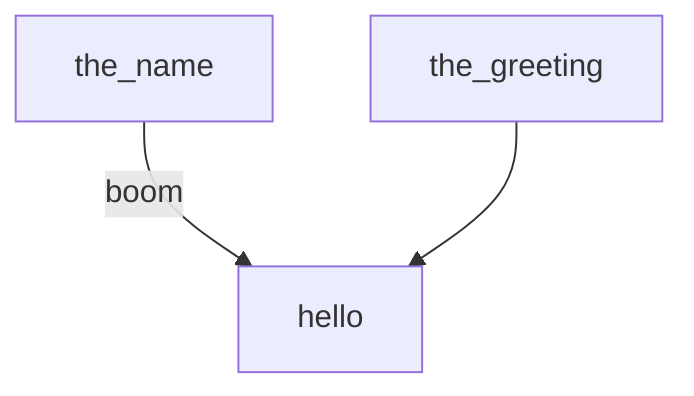

# Graph
```python

def the_name():
    return "Mása"

def the_greeting():
    return 'Hey'

def hello(name, greeting='Hello'):
    return f"{greeting} {name}!"
```


```mermaid
flowchart TB
the_name -->|boom|hello
the_greeting-->hello
```